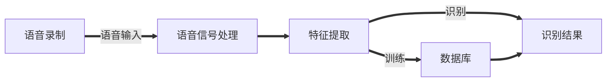

# LATEX

## 表格

```latex
\begin{table}
\begin{document}

\begin{tabular}{ccc}
\hline
姓名& 学号& 性别\\
\hline
Steve Jobs& 001& Male\\
Bill Gates& 002& Female\\
\hline
\end{tabular}
\end{table]

```


## 多个图片

```latex
\begin{figure}[htbp]
	\centering
	\begin{minipage}{0.32\linewidth}
		\centering
		\includegraphics[width=0.9\linewidth]{Figure/chutian.JPG}
		\caption{chutian1}
		\label{chutian1}%文中引用该图片代号
	\end{minipage}
	\begin{minipage}{0.32\linewidth}
		\centering
		\includegraphics[width=0.9\linewidth]{Figure/chutian.JPG}
		\caption{chutian2}
		\label{chutian2}%文中引用该图片代号
	\end{minipage}
	\begin{minipage}{0.32\linewidth}
		\centering
		\includegraphics[width=0.9\linewidth]{Figure/chutian.JPG}
		\caption{chutian2}
		\label{chutian2}%文中引用该图片代号
	\end{minipage}
	%\qquad
	%让图片换行，
	
	\begin{minipage}{0.32\linewidth}
		\centering
		\includegraphics[width=0.9\linewidth]{Figure/chutian.JPG}
		\caption{chutian3}
		\label{chutian3}%文中引用该图片代号
	\end{minipage}
	\begin{minipage}{0.32\linewidth}
		\centering
		\includegraphics[width=0.9\linewidth]{Figure/chutian.JPG}
		\caption{chutian4}
		\label{chutian4}%文中引用该图片代号
	\end{minipage}
\end{figure}

```



## 序列

```latex
\begin{itemize}
		\item [1)] 通过电脑录制音频；
		\item [2)] 将得到的音频数据进行预处理，经过端点检测得到理想的音频数据；
		\item [3)] 提取音频数据的MFCC特征；
		\item [4)] 进行DTWDTW算法搜索；
		\item [5)] 将得到的结果进行总结归纳；
	\end{itemize}
```

