# 数字逻辑电路复习大纲

## 5.1 数字逻辑系统概述

* 数字系统（Digital System）的基本模型（选择填空判断）

  * 信号处理单元

    * 时序电路
    * 状态信息、控制信号、输入/输出信号

  * 控制单元（**区分逻辑部件和数字系统的标志**）

    * 时序电路：状态寄存器

    * 算法、指令流、数据流

      > 算法：将数字系统执行的复杂任务转化成一个操作和测试序列
      >
      > **信息处理单元的基本功能是对指令流和数据流实施时间上和空间上的正确控制**

    * 两种实现方法：硬件逻辑方法、微程序法

      > 硬件逻辑方法：用逻辑电路生成每一个微操作的控制信号；速度高
      >
      > 微程序方法：计算机的每一条指令的功能通过执行一个微指令序列来实现。速度低，但是设计修改容易。

* 数字系统逻辑设计的基本步骤

  * 确定系统的逻辑功能
  * 确定系统方案（最困难和最有创造性的工作）
  * 对系统进行逻辑划分（划分成信息处理单元和控制单元）
  * 设计信号处理单元和控制单元

## 5.4 A/D转换和D/A转换

* A/D转换和D/A转换（必出一道单选？填空）

  * 模数A/D转换

    * 模数转换过程：采样、保持、量化、编码

      > 量化的方法和量化误差
      >
      > （1）舍尾取整法
      >
      > （2）四舍五入法（Δ/2）

    * 并行比较型A/D转换器原理（n位二进制输出需要2n-1个电压比较器）

    * ADC性能参数：分辨率、转换速率（**最重要的，ppt上面的误差可以不用看**）

      > 分辨率=Vimax/2^n----------n位二进制输出，Vimax为电压
      >
      > 双积分型ADC的转换速度最慢，需要几百毫秒左右
    >
      > 逐次逼近式ADC的转换速度较快，需要几十微秒
    >
      > 并行比较型ADC的转换速度最快，仅6需要几十纳秒
  
  * 数模D/A转换

    * 数模转换的基本方法
  
      > $N_B=D_{n-1}\times 2^{n-1}+D_{n-2}\times 2^{n-2}+\dots+D_{1}\times 2^{1}+D_{0}\times 2^{0}=\sum\limits_{i=0}^{n-1}D_{i}2^{i}$
      >
      > $v_o=K\times N_B$
  
    * 权电路D/A转换器原理
  
    * DAC性能参数：分辨率、精度、转换时间（速度）、转换误差（线性度）
  
      > 转换精度：分辨率（10位、8位标识DAC分辨率，或者$2^n$，通常是$\frac{1}{2^n-1}$）、转换误差(输出模拟电压的实际值与理想值之差的最大值)
      >
      > 转换误差的表示方法：用最低有效位的倍数表示1/2LSB
      >
      > 用输出电压满刻度的百分数表示1%FSR
      >
      > 转换时间（速度）：输出由全0到全1时间误差小于1/2LSB
  
  * PCM编码:二进制码、折叠码、格雷码

## 4.1 可编程逻辑概述

* PLD的发展历史
  * 最早出现 的PROM、EPROM、EEPROM、PLA（programmable logic array）
  * 随后出现的PAL（programmable array logic）、GAL（general array logic）
  * 目前使用的FPGA（field programmable gate array）、CPLD（complex programmable logic device）
* PLD的基本结构
  * 结构：==与阵列+或阵列==（**最容易出单选题**）、输入输出电路
  * 分类
    * 输出是否包含寄存器：组合PLD、时序PLD
    * 根据编程内容：ROM、PLA、PAL、GAL
    * 根据容量大小：SPLD（simple）、CPLD
* PLD的编程工艺和表示方法
  * PLD的编程工艺
    * 早期：掩膜、熔丝式、TTL
    * 后期：NMOS、CMOS、EECMOS
    
  * PLD的逻辑符号表示
  
    * 输入输出缓冲器的符号表示
  
    * 编程点的连接方法
  
      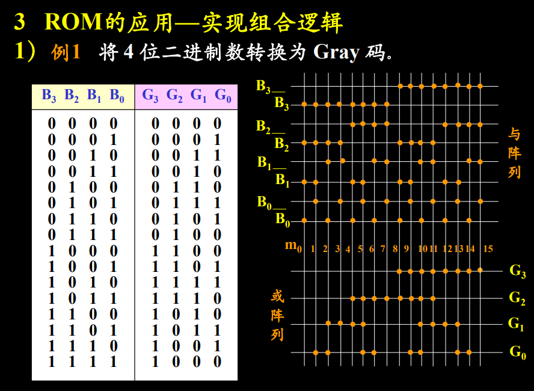
  
      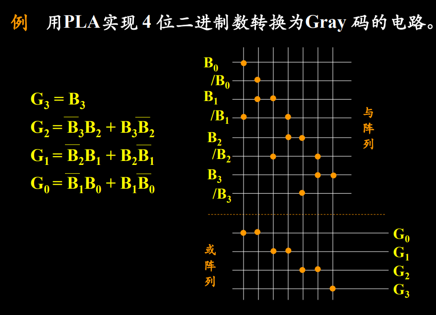
  
    * ==与门和或门的表示方法==
* PLD的设计过程
  * 设计过程
  * 主要优点

## 4.2 简单可编程逻辑器件

* 可编程只读存储器PROM（单选填空）
  * ROM结构特点：与阵列固定、或阵列可编程
  * ROM按内部结构分为
    * ROM：掩膜可编程
    * PROM：一次可编程
    * EPROM：光可擦除（多次）可编程
    * EEPROM：电可擦除（多次）可编程
  * 掩膜ROM的阵列结构和存储单元
  * 
* 可编程逻辑阵列PLA
* 可编辑阵列逻辑PAL
* 通用阵列逻辑GAL

## 3.1 时序逻辑电路基础

* 熟悉时序电路的一般形式、分类和描述方法

  * 时序电路的一般形式
  * 分类
    * 按照引起状态发生变化的原因可以分为：同步时序电路、异步时序电路
    * 按照输出信号x的特性可以分为：脉冲输入、电平输入
    * 按照输出特性可以分为：Mealy型和Moore型
      * mealy输出=F(input,Q)
      * moore output = F(Q)
  * 时序电路的描述方法：次态方程、功能表、次态真值表、次态卡诺图、状态表、状态图

* 掌握时序电路的双稳态元件的逻辑符号、次态真值表、和次态方程

  * 双稳态元件的特点

  * S-R锁存器

    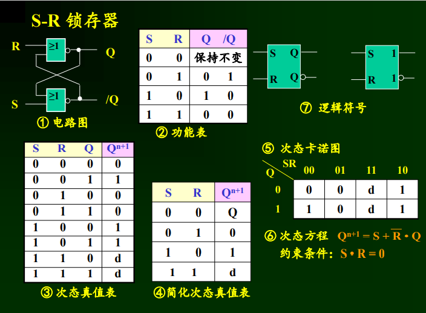

  * /S-/R锁存器

    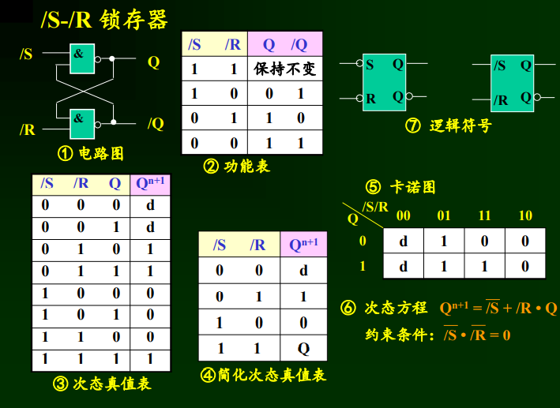

  * 主从S-R触发器和主从J-K触发器

    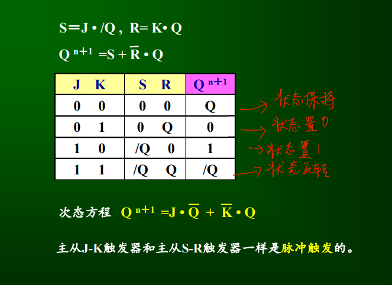

  * 边沿触发的D触发器

    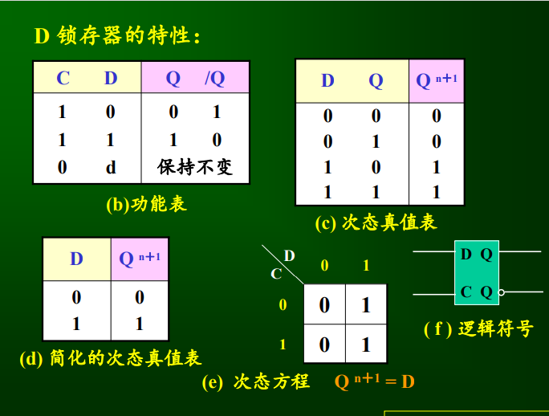

  * 边沿触发J-K触发器

  * T触发器

    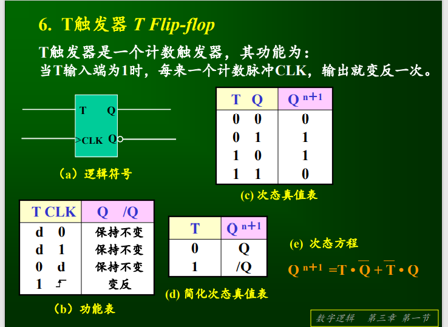

## 3.2 同步时序电路的设计与分析（重点）

* 分析

  * 分析步骤
  * 分析举例

* 设计

  * 设计步骤概述

  * 设计的五个步骤

    * 建立原始状态表

    * 状态化简

      * 状态等效：加入任意输入序列，所产生的输出序列完全一致

        * 具有传递性$(S_1,S_2),(S_2,S_3)\longrightarrow(S_1,S_3)$

        * 等效类

        * 最大等效类

        * > - 输出完全相同
          > - 次态满足下面条件之一
          >   1. 次态相同
          >   2. 次态交错
          >   3. 次态维持
          >   4. 后续状态等效
          >   5. 次态循环
        
    * 状态相容
    
      * 无传递性
    
        * 相容性
    
        * 最大相容性

        * > - 输出相同
          > - 次态满足下面条件之一
          >   1. 次态相同
          >   2. 次态交错
          >   3. 次态维持
          >   4. 后续状态相容
          >   5. 次态循环
    
    * 状态分配
    
      * 状态个数为n，触发器个数为K，$K = \lceil log_2n\rceil$
    
      * 相邻状态分配法
        * 目标是最简激励函数表达式
    
        * 三个规则
    
          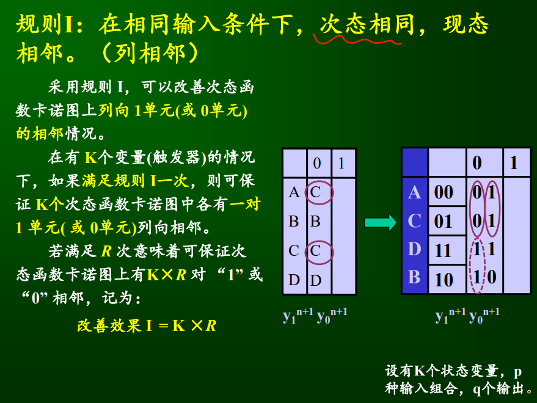
    
          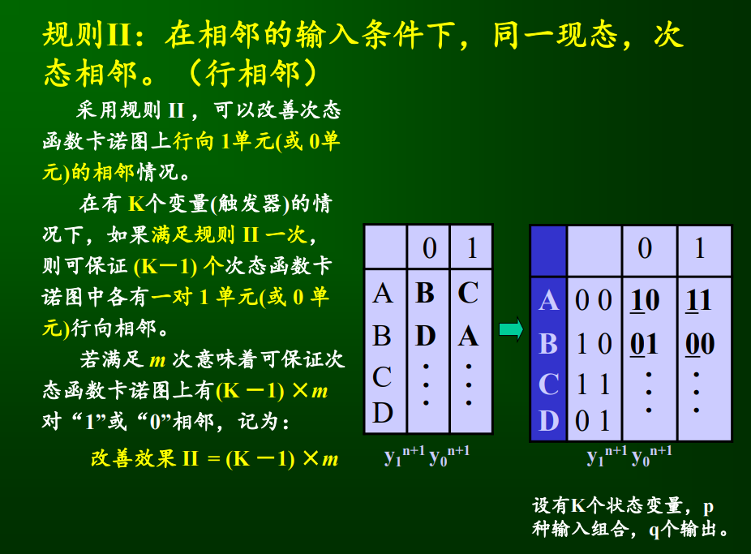
    
          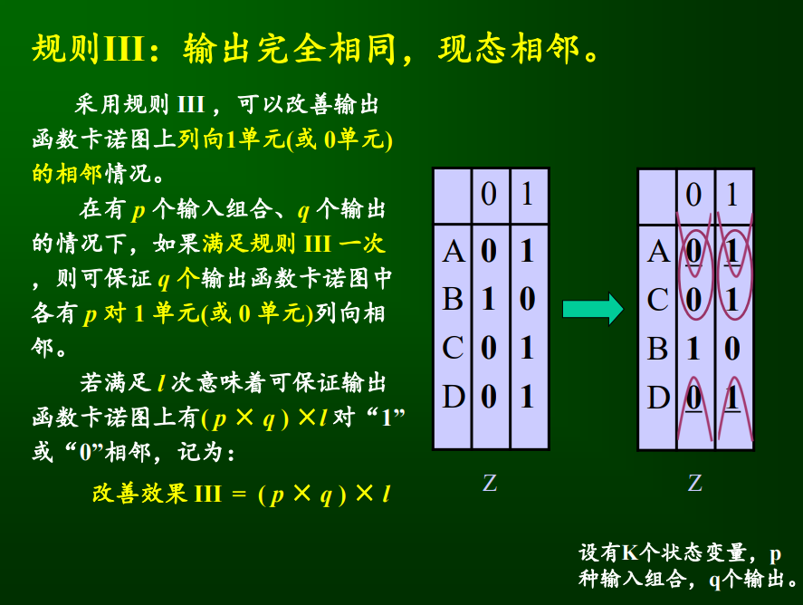
    
          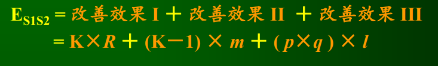
    
        * 分配原则
    
    * 激励函数和输出函数的确定

* 设计举例

## 3.3脉冲异步时序电路的分析与设计

* 脉冲异步时序电路概述
  * 脉冲异步时序电路与同步时序电路的相同点
  * 脉冲异步时序电路与同步时序电路的差异点
  * 脉冲异步时序电路输入的限制

## 3.4 常用MSI时序逻辑器件（重点）

* 计数器
  * 计数器分类及其原理
    * 分类
      * 同步与异步计数器
      
        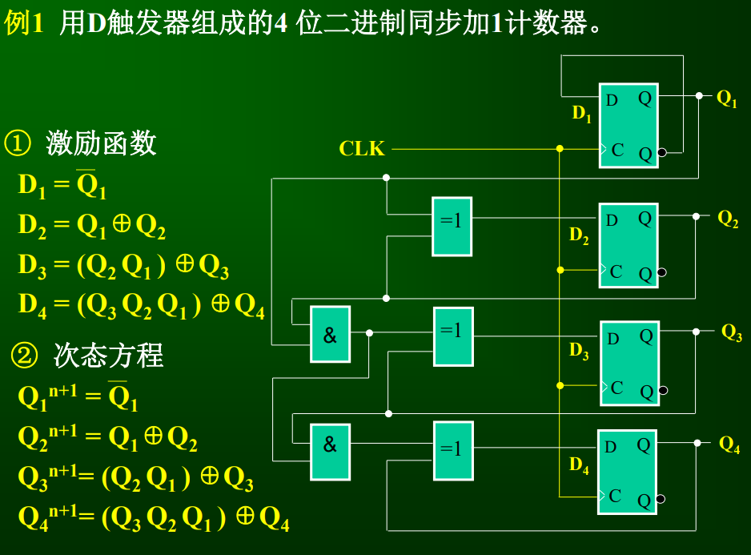
      
        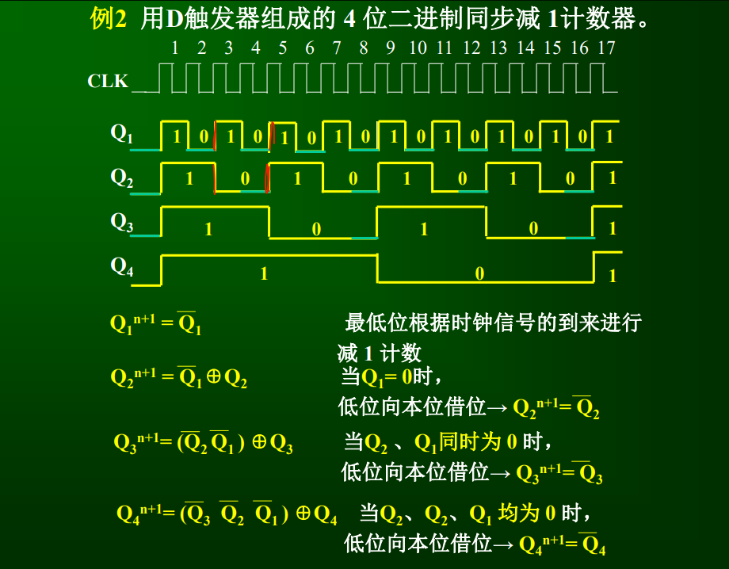
      
        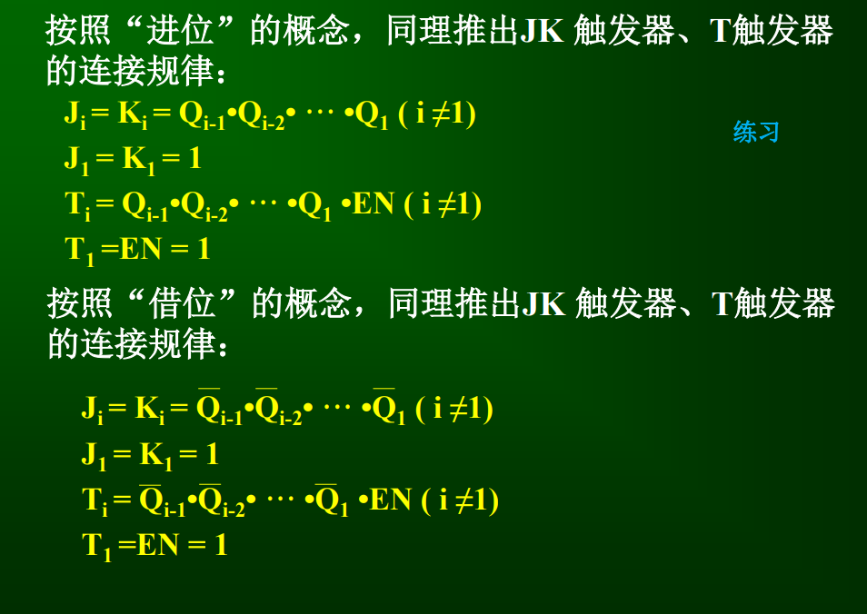
      
      * 加法、减法、可逆计数器
      
      * 二进制同步计数器
      
      * 二进制异步计数器
      
        * 强制位法适用于同步和异步电路，会使得第一个状态时间变短，a+1
        * 预置位法只适用于同步电路，在第a拍就
    
  * MSI计数器及其应用
  
    * 74LS161
  
    * 74LS169是一个可逆计数器
  
      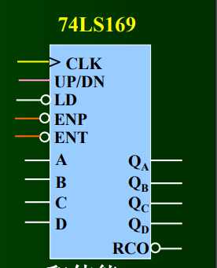
  
    * 74LS163
  
      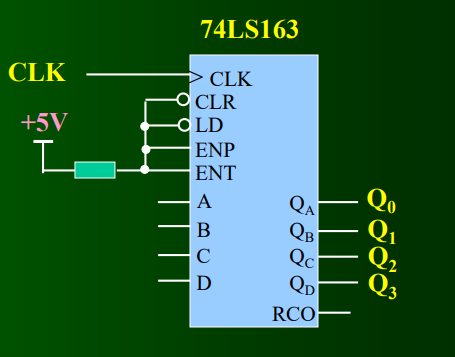
  
* 寄存器
  * 寄存器分类
  
    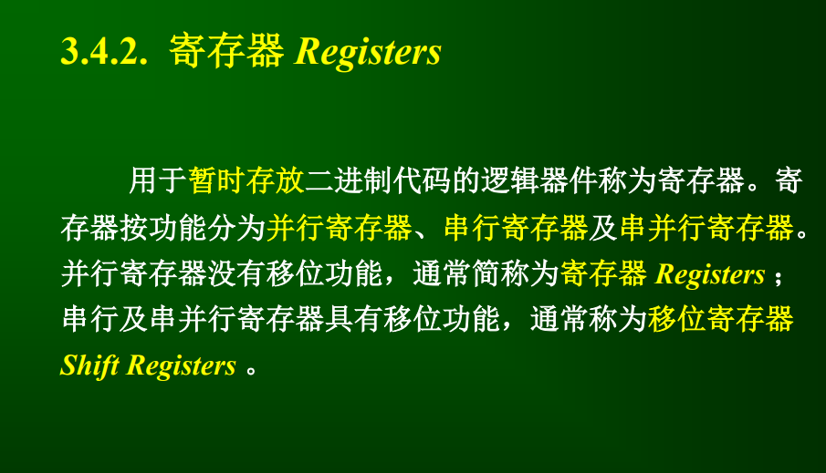
  
    * 并行寄存器74LS175
  
      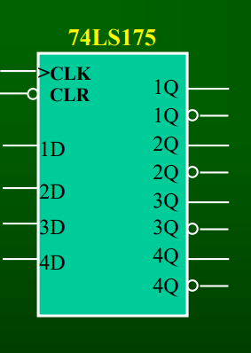
  
    * 移位寄存器
  
  * MSI寄存器及其应用
  
    * 用计数器实现计数型节拍分配器
  
      (电平型)
  
      $Y_0=\overline Q_1\overline Q_0$
  
      $Y_1=\overline Q_1 Q_0$
  
      $Y_2= Q_1\overline Q_0$
  
      $Y_3=Q_1 Q_0$
  
      (脉冲型)
  
      后面乘一个CLK
  
* 脉冲发生器原理

  * 脉冲信号是什么

* 多谐振荡器

  * 工作特性：振荡
  * 环形振荡器
  * RC多谢振动器工作原理

* 单稳态电路

  * 工作特性：单稳态
  * 积分型单稳态触发器工作原理分析

* 施密特双稳态电路

  * 工作特性：双稳态
  * 工作波形和传输特性
  * 应用：整形电路、消除信号上的干扰、幅度鉴别

* 555定时器是一个数模混合的

  * 构成多谐振荡器

  * 构成单稳态触发器

  * 构成施密特触发器

    

## 问题

* 并行比较型A/D转换器在量化的时候是舍尾取整法？